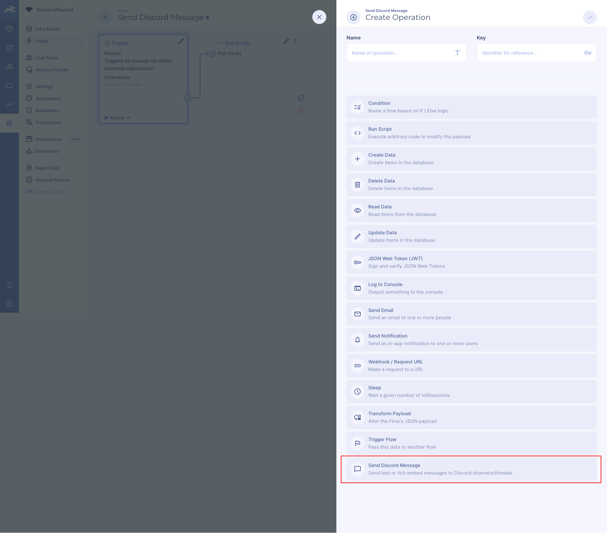
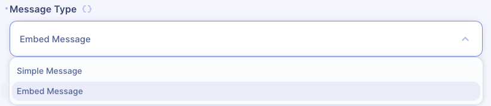
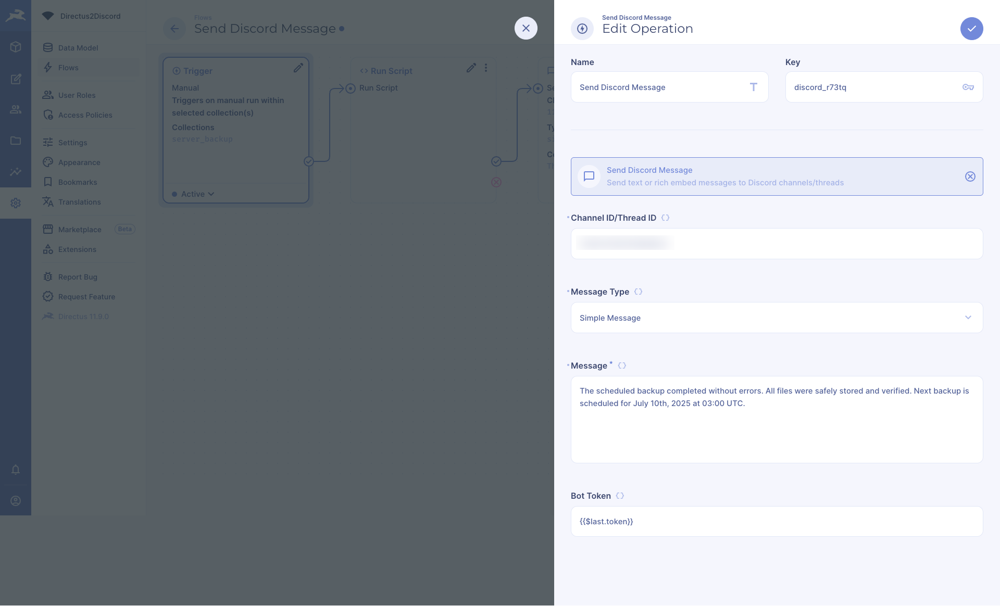
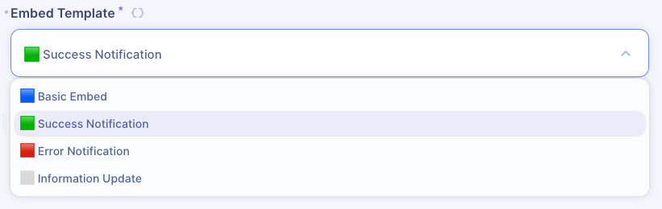
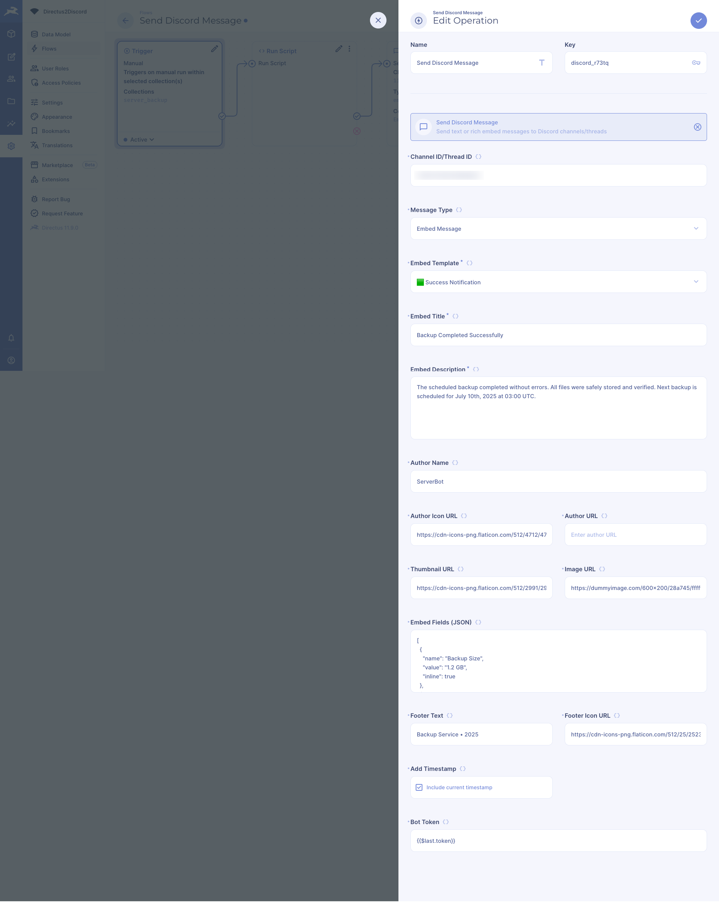
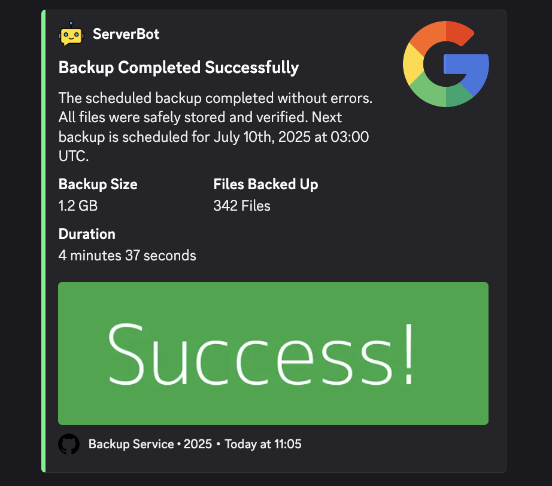

# Directus Discord Operation

A powerful Directus operation extension that enables sending text messages and rich embeds to Discord channels or threads directly from your Directus flows. Perfect for notifications, alerts, updates, and more.

## Repository

- GitHub: [directus-extension-discord-operation](https://github.com/kashyap-thakar/directus-extension-discord-operation)

## Screenshots

Here are some screenshots showing the extension in action:

1. Operation in Flow Builder:
   

2. Message Type Selection:
   

3. Simple Message Configuration:
   

4. Simple Message Example:
   

5. Embed Templates:
   

6. Embed Message Configuration:
   

7. Embed Message Example:
   

## Features

- **Simple Text Messages**: Send plain text messages to any Discord channel or thread
- **Rich Embed Messages**: Create beautiful, structured messages with:
  - Pre-designed templates (Basic, Success, Error, Info)
  - Custom titles and descriptions
  - Author information with name, icon, and URL
  - Thumbnail and main images
  - Custom fields with inline options
  - Footer text and icon
  - Timestamp
- **Dynamic Templates**:
  - 🟦 Basic Embed - Clean, professional blue theme (#3498DB)
  - 🟩 Success Notification - Positive green theme (#57F287)
  - 🟥 Error Notification - Alert red theme (#ED4245)
  - ⬜️ Information Update - Informative cyan theme (#3498DB)
- **Secure Token Handling**: Bot token is stored securely using Directus's password field type

## Requirements

- Directus version ^10.1.11
- Node.js version >=18.0.0
- A Discord bot with:
  - `Send Messages` permission
  - `Embed Links` permission (for rich embeds)

## Installation

```bash
# Using npm
npm install directus-extension-discord-operation

# Using yarn
yarn add directus-extension-discord-operation

# Using pnpm
pnpm add directus-extension-discord-operation
```

## Discord Bot Setup

1. Create a Discord Application:

   - Go to [Discord Developer Portal](https://discord.com/developers/applications)
   - Click "New Application" and give it a name
   - Navigate to the "Bot" section
   - Click "Add Bot"
   - Copy the bot token (you'll need this later)

2. Invite the Bot to Your Server:

   - Go to the "OAuth2" section
   - In "Scopes", select "bot"
   - In "Bot Permissions", select:
     - Send Messages
     - Embed Links
   - Copy the generated URL and open it in a browser
   - Select your server and authorize the bot

3. Get Channel/Thread ID:
   - Enable Developer Mode in Discord (User Settings > App Settings > Advanced)
   - Right-click on the channel/thread
   - Click "Copy ID"

## Usage in Flows

1. Add Operation:

   - In your Directus flow, click "Add Operation"
   - Select "Send Discord Message"

2. Configure Basic Settings:

   - Enter the Channel/Thread ID
   - Choose Message Type:
     - Simple Message
     - Embed Message

3. For Simple Messages:

   - Just enter your text message

4. For Embed Messages:

   - Choose a template (Basic, Success, Error, Info)
   - Set Title and Description
   - Optional: Configure additional elements:
     - Author information
     - Images
     - Fields
     - Footer
     - Timestamp

5. Add Bot Token:
   - Enter your Discord bot token
   - The token is stored securely

## Embed Fields Format

When adding fields to your embed, use JSON array format:

```json
[
  {
    "name": "Field Title",
    "value": "Field Value",
    "inline": true
  },
  {
    "name": "Another Field",
    "value": "More information",
    "inline": false
  }
]
```

## Examples

### Simple Message

```json
{
  "channelId": "YOUR_CHANNEL_ID",
  "messageType": "simple",
  "message": "Hello from Directus!",
  "token": "YOUR_BOT_TOKEN"
}
```

### Success Embed

```json
{
  "channelId": "YOUR_CHANNEL_ID",
  "messageType": "embed",
  "embedTemplate": "success",
  "embedTitle": "Operation Successful",
  "embedDescription": "The backup process completed successfully.",
  "embedFields": "[{\"name\": \"Time\", \"value\": \"5 minutes\", \"inline\": true}, {\"name\": \"Size\", \"value\": \"1.2GB\", \"inline\": true}]",
  "embedTimestamp": true,
  "token": "YOUR_BOT_TOKEN"
}
```

## Troubleshooting

Common issues and solutions:

1. **Message Not Sending**

   - Verify bot token is correct
   - Check if bot has required permissions
   - Ensure channel/thread ID is correct

2. **Embed Not Showing**

   - Verify bot has "Embed Links" permission
   - Check JSON format for fields
   - Ensure URLs are valid for images

3. **Fields Not Appearing**
   - Verify JSON array format is correct
   - Maximum 25 fields per embed
   - Field name and value are required

## Contributing

Contributions are welcome! Please feel free to submit a Pull Request.

## License

This project is licensed under the MIT License - see the [LICENSE](LICENSE) file for details.

## Author

Kashyap Thakar

- GitHub: [@kashyap-thakar](https://github.com/kashyap-thakar)
